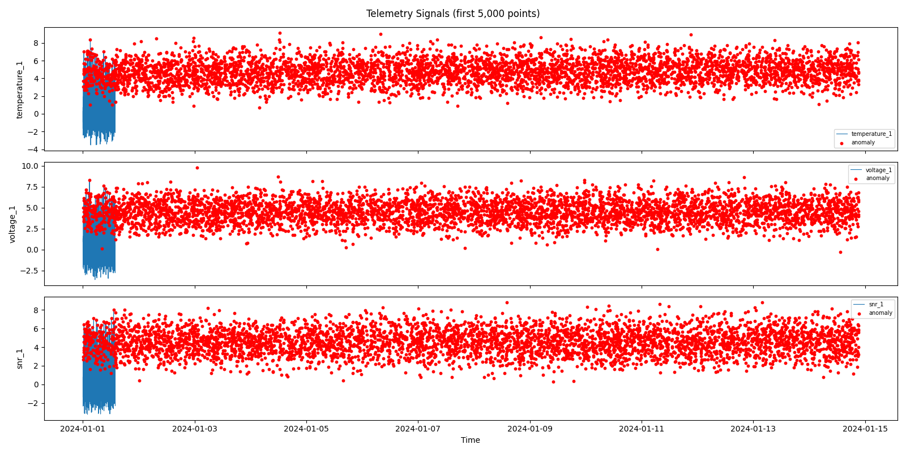
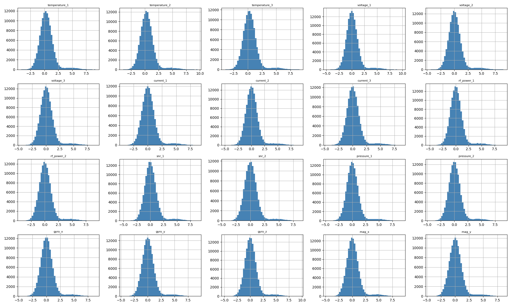
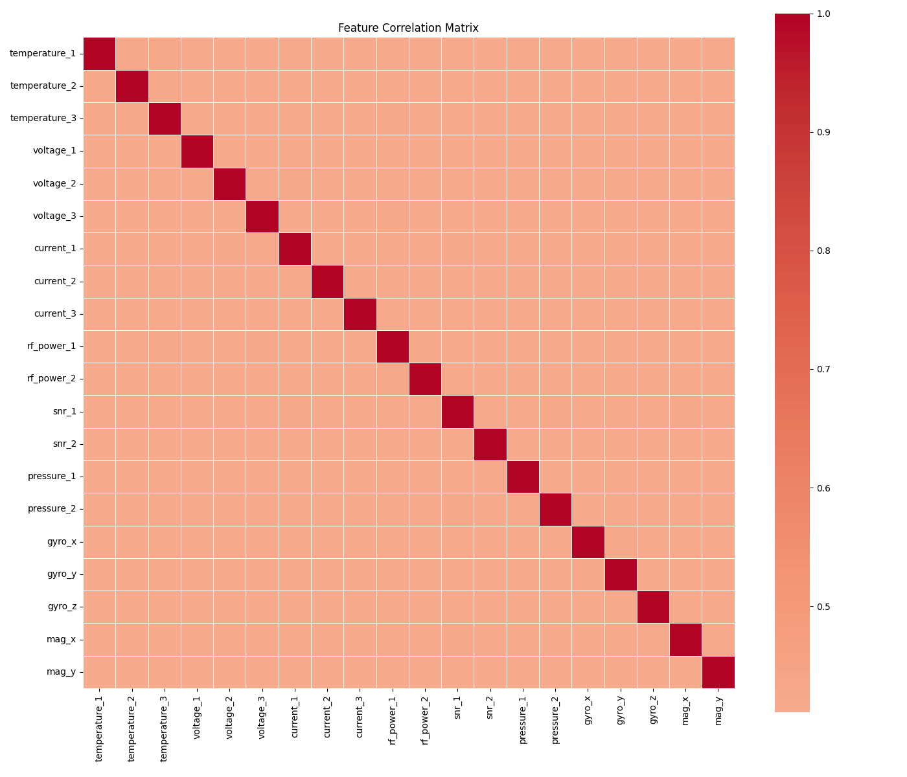
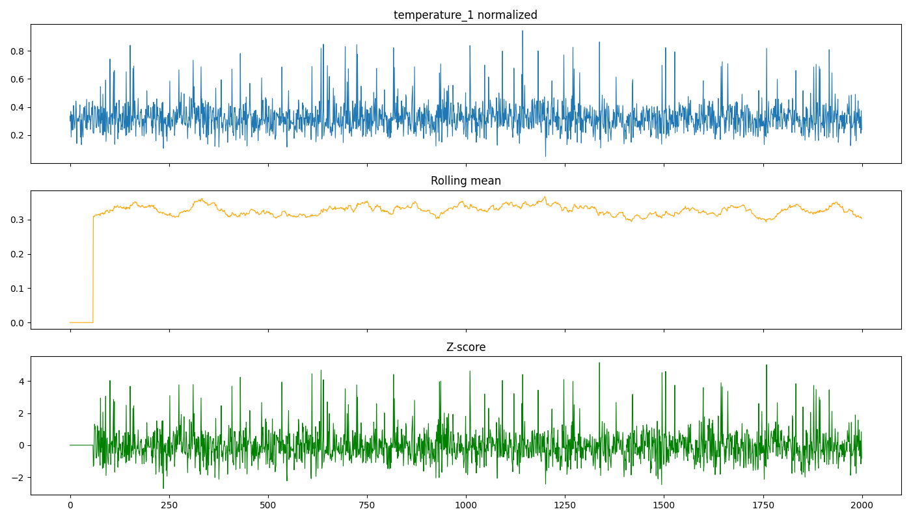
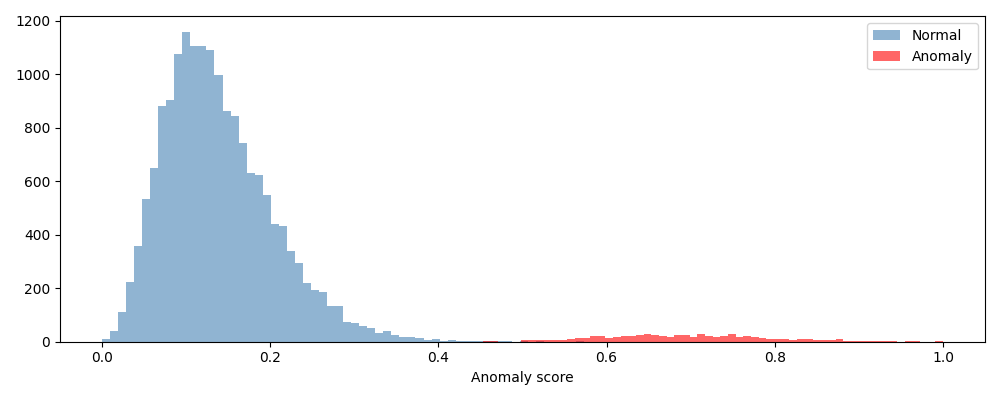
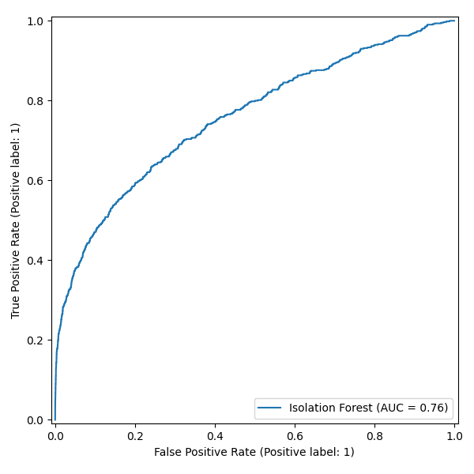
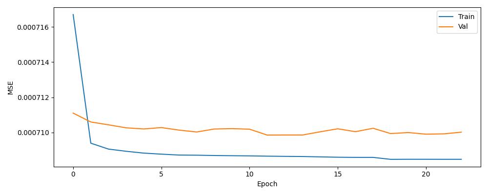
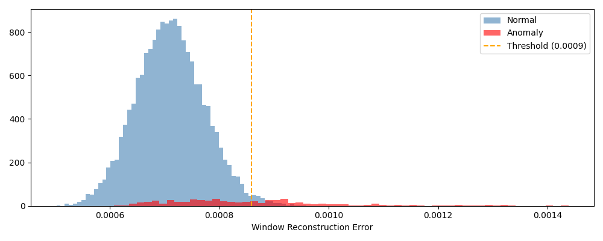
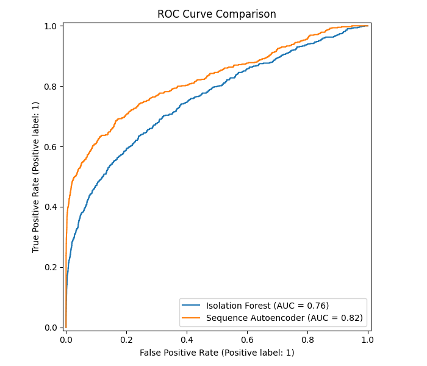
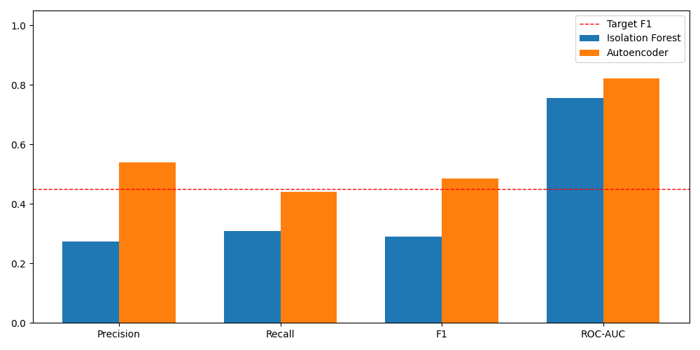

# Satellite Anomaly Detection

## Project Objective

Satellites generate continuous streams of telemetry — temperature readings, voltage levels, RF signal quality, attitude sensor data — and somewhere in that stream, failures are hiding. This project builds two unsupervised models to find them before they become critical.

The idea is straightforward. Train models only on normal operating data, then flag anything that looks different. Two approaches are compared: an Isolation Forest as a statistical baseline, and a PyTorch autoencoder with domain-specific feature engineering. Both are evaluated on synthetic telemetry modelled after the ESA OPS-SAT nanosatellite dataset.

---

## Dataset

The pipeline is designed for the [OPS-SAT Anomaly Detection dataset](https://zenodo.org/records/12771689), a multivariate time series recorded aboard ESA's OPS-SAT nanosatellite. Each observation is a 20-dimensional vector sampled every 10 seconds.

The features cover four subsystems:

- **Thermal** — on-board computer, battery, and solar panel temperatures
- **Power** — bus voltage and current rails (3 channels each)
- **Communications** — RF transmit power and signal-to-noise ratio
- **Attitude** — gyroscope (3 axes), magnetometer (2 axes), pressure sensors

Key numbers: ~120,000 time points, 20 features, 3.8% anomaly rate. Anomalies include thermal excursions, power drops, RF degradation, and attitude instability.

A synthetic data generator is included for development and testing. Place the real dataset in the `data/` directory (not committed to the repository).







---

## Methodology

### 1. Preprocessing

All preprocessing respects chronological order. No shuffling, anywhere. Shuffling a time series leaks future information into training and silently inflates metrics.

**Normalization.** Min-Max scaling brings every feature into [0, 1]. The scaler is fitted on the training set only, then applied identically to validation and test sets.

**Rolling statistics.** For each feature, a 60-point sliding window (~10 minutes) computes the rolling mean, rolling standard deviation, and a local z-score. This gives each sample context about its recent history, which is critical for catching slow drifts that look normal in isolation.

**Orbital phase encoding.** A low Earth orbit takes about 90 minutes — 540 samples at 10-second intervals. The position within each orbit is encoded as a sine-cosine pair, which avoids the jump that a simple modulo counter would create. This lets the model learn that certain behaviors are normal at specific orbital phases (e.g., temperature swings during sun/shadow transitions).

**Eclipse detection.** When the satellite enters Earth's shadow, solar power drops and RF quality degrades. This is normal, not an anomaly. Eclipse periods are flagged by thresholding the mean SNR at its 25th percentile on the training set, giving the models a way to distinguish expected eclipse effects from real faults.

**Physics-based features.** Four derived features encode domain knowledge directly:

| Feature | What it captures |
|---|---|
| Thermal gradient ($T_i - T_j$) | Heat flow between adjacent subsystems |
| Power estimate ($V \times I$) | Ohmic power per rail — deviations signal faults |
| Gyro magnitude ($\sqrt{\omega_x^2 + \omega_y^2 + \omega_z^2}$) | Total rotation rate — spikes mean attitude problems |
| Mag magnitude ($\sqrt{B_x^2 + B_y^2}$) | Geomagnetic field intensity — anomalies point to sensor issues |

**Data split.** 70% train / 15% validation / 15% test, in strict chronological order.



### 2. Isolation Forest (Baseline)

Isolation Forest works on a simple insight: anomalies are rare and different, so they are easy to separate. The algorithm builds an ensemble of random trees. At each node, it picks a random feature and a random split. Points that get isolated in few splits are likely anomalies — they sit in sparse regions of the feature space.

Hyperparameters: 200 trees, contamination set to 0.038 (matching the known anomaly rate), 80% sub-sampling per tree.

```python
from src.models.isolation_forest import SatelliteIsolationForest

model = SatelliteIsolationForest()
model.fit(X_train)
metrics = model.evaluate(X_test, y_test)
```





### 3. Autoencoder (PyTorch)

The autoencoder is a neural network trained to compress normal telemetry into a small latent space and then reconstruct it. If a new sample is normal, reconstruction is accurate. If it is anomalous, the network struggles and the reconstruction error spikes — that error becomes the anomaly score.

**Architecture.** A symmetric encoder-decoder with ReLU activations:

```
Encoder:  20 → 128 → 64 → 32 → 8  (latent space)
Decoder:   8 →  32 → 64 → 128 → 20
```

The bottleneck of 8 dimensions forces the network to learn only the dominant structure of normal operations, discarding noise.

**Domain-weighted loss.** Not all sensors matter equally. RF and power channels are mission-critical, so their reconstruction errors are weighted more heavily (1.5x for communications, 1.3x for power, 0.8x for attitude sensors). This makes the model more sensitive to the anomalies that actually matter operationally.

**Training.** Adam optimizer, learning rate $5 \times 10^{-4}$ with weight decay $10^{-5}$, batch size 128, up to 120 epochs. A ReduceLROnPlateau scheduler halves the learning rate after 5 stagnant epochs, and early stopping (patience 15) prevents overfitting.

**Threshold.** After training, the reconstruction error is computed on the validation set. The 95th percentile of that distribution becomes the decision boundary — anything above it is flagged as anomalous.

```python
from src.models.autoencoder import SatelliteAutoencoder

model = SatelliteAutoencoder(input_dim=20)
model.fit(X_train, X_val)
metrics = model.evaluate(X_test, y_test)
```







---

## Key Equations

**Min-Max normalization** — scales each feature to [0, 1]:

$$x' = \frac{x - x_{\min}}{x_{\max} - x_{\min}}$$

Each value is shifted by its minimum and divided by its range. Simple, but the key rule is: fit the scaler on training data only.

**Rolling z-score** — measures how far a value deviates from its recent history:

$$z_t = \frac{x_t - \mu_t}{\sigma_t}$$

where $\mu_t$ and $\sigma_t$ are the mean and standard deviation over the last $w = 60$ samples. A z-score of 3 means the current reading is 3 standard deviations away from what was normal in the past 10 minutes.

**Orbital phase encoding** — maps the satellite's orbit position to a smooth, continuous representation:

$$
\text{orbital\_cos}_t = \cos\left( \frac{2\pi \, (t \bmod T)}{T} \right), \quad
\text{orbital\_sin}_t = \sin\left( \frac{2\pi \, (t \bmod T)}{T} \right)
$$
where $T = 540$ samples (~90 minutes). The sin-cos pair avoids the discontinuity that a raw counter would have at period boundaries.

**Isolation Forest anomaly score** — how easily a point can be separated from the rest:

$$s(x, n) = 2^{-E[h(x)] \,/\, c(n)}$$

$E[h(x)]$ is the average tree depth needed to isolate $x$, and $c(n)$ normalizes by the expected depth for $n$ samples. Scores near 1 are anomalies; scores near 0.5 are ambiguous; scores near 0 are clearly normal.

**Weighted MSE loss** — the autoencoder's training objective, emphasizing critical subsystems:

$$\mathcal{L} = \frac{1}{N} \sum_{i=1}^{N} \frac{\sum_{j=1}^{d} w_j \,(x_{ij} - \hat{x}_{ij})^2}{\sum_{j=1}^{d} w_j}$$

Each feature $j$ has a weight $w_j$ reflecting how important that sensor is. The same weighted error, computed per sample at inference, serves as the anomaly score.

**Anomaly threshold** — calibrated on the validation set:

$$\tau = \text{Percentile}_{95}\!\left(\left\lbrace \mathcal{L}_i \right\rbrace_{i \in \text{val}}\right)$$

Any test sample with reconstruction error above $\tau$ is classified as anomalous. The 95th percentile means roughly 5% of normal validation samples will be flagged — a deliberate trade-off between sensitivity and false alarms.

---

## Evaluation

Both models are evaluated on the held-out test set (15% of data, strictly after training and validation in time). Metrics used: precision, recall, F1-score, and ROC-AUC.

| Model | Precision | Recall | F1-score | ROC-AUC |
|---|---|---|---|---|
| Isolation Forest | 0.2727 | 0.3078 | 0.2892 | 0.7569 |
| **Autoencoder** | **0.5342** | **0.4446** | **0.4853** | **0.8207** |

The autoencoder roughly doubles the Isolation Forest's precision and F1, and gains 6 points on AUC. The main reason: the rolling features and domain-weighted loss give the autoencoder temporal context and operational awareness that a pointwise tree-based method simply cannot capture.

The Isolation Forest is still useful as a fast, interpretable sanity check. But for operational deployment, the autoencoder is the clear choice.



---

## Repository Structure

```
satellite-anomaly-detection/
├── data/                         # OPS-SAT dataset (not committed)
├── notebooks/
│   ├── 01_eda.ipynb              # Exploratory data analysis
│   ├── 02_preprocessing.ipynb    # Normalization, rolling features, split
│   ├── 03_isolation_forest.ipynb # Baseline model
│   ├── 04_autoencoder.ipynb      # Deep learning model
│   └── 05_results.ipynb          # Side-by-side comparison
├── src/
│   ├── models/
│   │   ├── isolation_forest.py   # SatelliteIsolationForest wrapper
│   │   └── autoencoder.py        # SatelliteAutoencoder (PyTorch)
│   └── utils/
│       └── preprocessing.py      # Full preprocessing pipeline
├── results/                      # Saved plots and figures
├── app.py                        # Streamlit dashboard
└── requirements.txt
```

---

## Installation and Execution

```bash
pip install -r requirements.txt
```

Launch the interactive dashboard:

```bash
streamlit run app.py
```

The dashboard lets you generate synthetic data, run both models, and compare their results side by side — anomaly overlays on telemetry, score distributions, and metrics.

To use the real OPS-SAT dataset, place the CSV or Parquet file in the `data/` directory and load it through the notebook pipeline (`01_eda.ipynb` onward).
